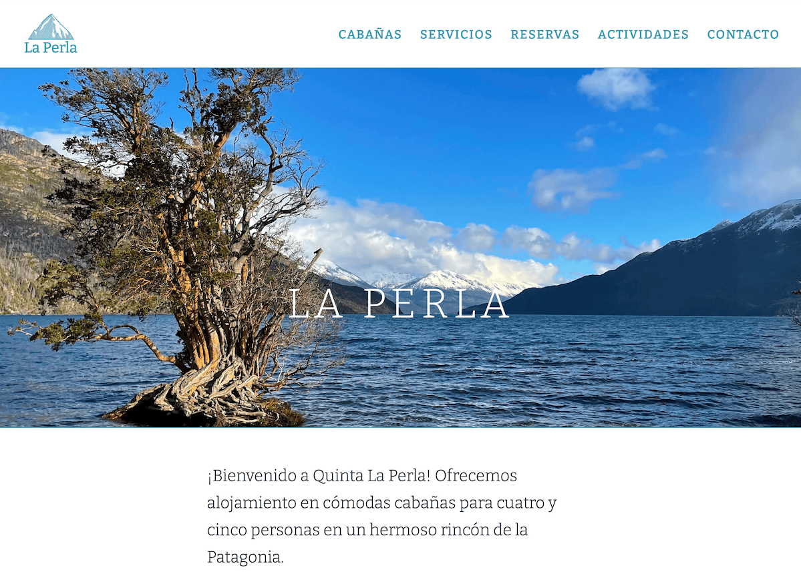

# La Perla Wordpress theme

A Wordpress theme designed for the [Rancho La Perla](https;//laperla.me/)
website.

## Overview

The theme is a _child theme_ built upon
[Fitmas](https://wptf.themepul.co/fitmas/), a theme by
[themepul](https://themeforest.net/user/themepul).

## Detailed description

## Features

* Built on [Bootstrap](https://getbootstrap.com/) for responsiveness and
  well-defined components

## Setup & Installation

First the parent theme, Fitmas, and then this child theme must be installed in
the `/wp-content/themes/` folder, directly under the Wordpress site's root
directory. The [Wordpress Codex](https://codex.wordpress.org/Installing_WordPress) 
publishes detailed documentation on all aspects of Wordpress administration.

The Fitmas theme has many dependencies, and a detailed guide for further
development, thus it is advisable to refer to the official [Fitmas documentation](https://intro.themepul.com/fitmas/doc/) for a complete
installation and configuration guide.

## Usage & Details

## Credits

With thanks to:

* [themepul](https://themeforest.net/user/themepul), for the parent theme,
  [Fitmas](https://wptf.themepul.co/fitmas/)
* [Huerta Tipográphica](https://huertatipografica.com/en/fonts/bitter-ht) for
  their excellent _Bitter HT_ typeface
* [Mozilla](http://mozilla.github.io/Fira/) for their Fira and Fira Sans
  typeface families
* [Nord](https://www.nordtheme.com/) for their elegant and muted colour palette
